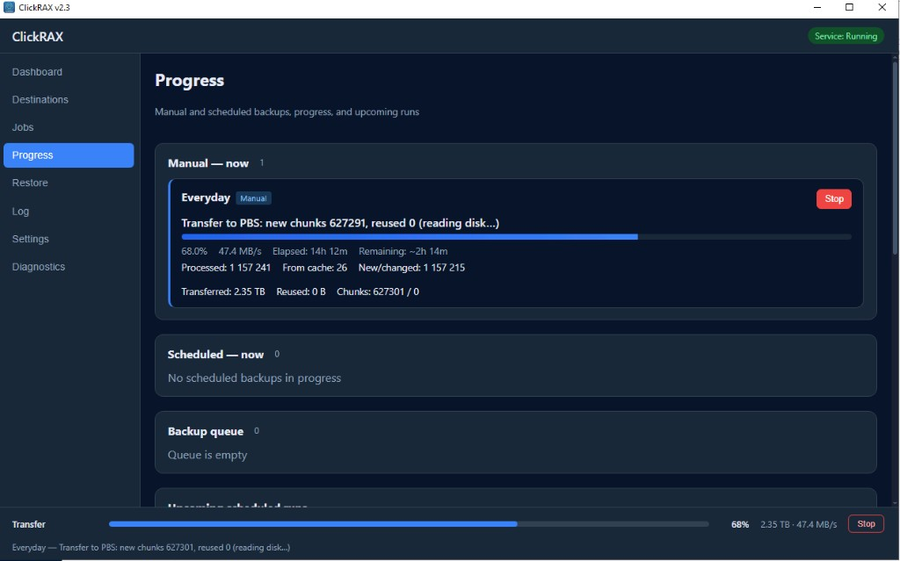
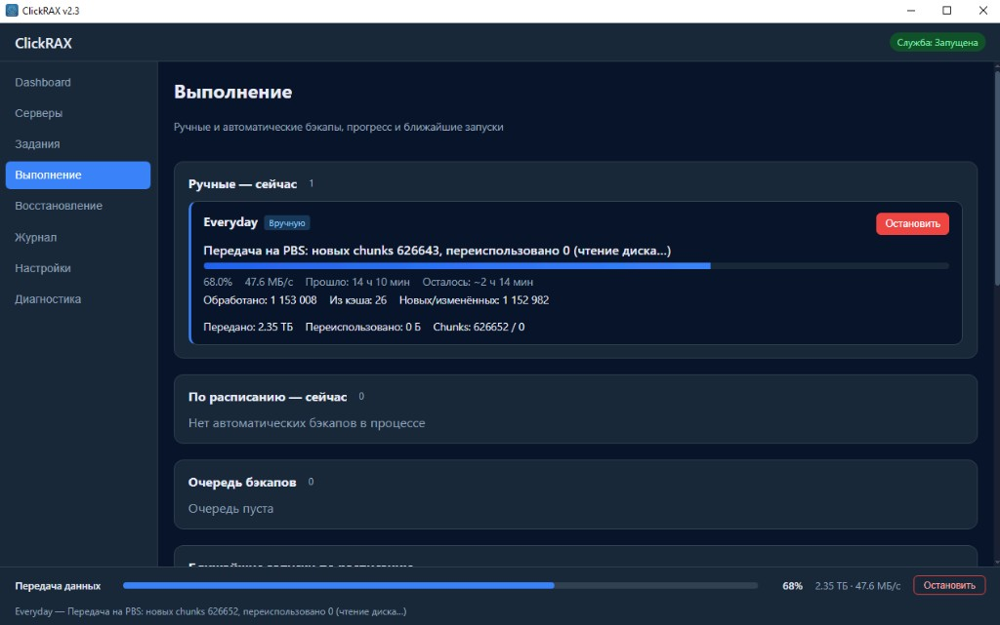

# ClickRAX

**Author:** John Watson · Telegram [@Johnwatson7777](https://t.me/Johnwatson7777)  
**Languages:** [English](README.en.md) · [Русский](README.md)

Windows backup client for **Proxmox Backup Server** — incrementals, VSS, restore a file from a snapshot without hand-running `proxmox-backup-client`.

Also **SMB** and **FTP/FTPS**: incremental ZIP with NTFS metadata. For home labs and small setups where PBS is already there.

**Current version: 2.3.15** — [clickrax.exe](https://github.com/clickrax/clickrax/raw/main/release/v2.3/clickrax.exe) · [clickrax-cli.exe](https://github.com/clickrax/clickrax/raw/main/release/v2.3/clickrax-cli.exe) · [ZIP](https://github.com/clickrax/clickrax/raw/main/release/v2.3/clickrax-windows-amd64-portable.zip) · [installer](https://github.com/clickrax/clickrax/raw/main/release/v2.3/clickrax-amd64-installer.exe) · [папка release/v2.3](https://github.com/clickrax/clickrax/tree/main/release/v2.3)

> **Downloading exe:** ready-made files are in **[release/v2.3/](https://github.com/clickrax/clickrax/tree/main/release/v2.3)** (links above).

---

## Screenshots

**Progress** during a PBS backup: throughput, chunks, queue, and service status. UI in English and Russian.





---

## Where ClickRAX came from

In 2018 I bought a new **HP ProLiant DL380 Gen9** for backups — about **$48,000** at 2018 exchange rates. StoreOnce, **14 TB** license, **40 TB** of disks in the box. HP quoted almost the full server price just to unlock the rest of the capacity. Paying again for hardware that was already there made no sense. Swapped the controller, got all 40 TB.

After a quote like that, writing our own stuff looked saner than feeding vendor licensing forever. StoreOnce ran a while longer, then I put **PBS** in. Still had Windows boxes to back up; `proxmox-backup-client` from a shell every day is not my idea of fun. Built **PbsWinBackup**, then a GUI, service, proper incrementals — **ClickRAX**.

Only on GitHub now. Ran it privately for years — our server, workstations, local PBS and SMB.

---

## Why ClickRAX, not proxmox-backup-client alone

Proxmox ships a **CLI-only** `proxmox-backup-client` for Windows: scripts, Task Scheduler, manual restore from the terminal.

**ClickRAX is a desktop GUI** (EN/RU) on top of native PBS format (PXAR, chunk dedup, verify):

- point-and-click PBS setup, fingerprint pinning, jobs and schedules;
- Windows service for unattended backups;
- restore a file or folder from the snapshot catalog;
- fast file-level incremental (v2.3+) — skips unchanged files on disk;
- plus SMB/FTP, CLI, Zabbix.

There is no real **open-source GUI client for PBS on Windows** in the same league — most setups wrap the CLI in scripts or backup elsewhere, not into the PBS datastore.

Keywords: *Windows PBS backup GUI*, *Proxmox Backup Server Windows client*, *graphical PBS backup*.

---

## Why ClickRAX

The usual “install PBS and back up Windows” path hits one of two walls: glue everything with scripts, or accept that PBS incrementals still read the entire disk for hours. ClickRAX is built for day-to-day admin work: GUI, Windows service, scheduling, and restoring a single file or folder from a snapshot catalog.

On PBS it uses the native format (PXAR + chunk dedup). Since v2.3, **fast file-level incrementals** skip unchanged files on disk — size/mtime comparison and chunk reuse from the server. On large volumes (hundreds of GB+), this dramatically shortens the second and subsequent runs.

---

## Features

**PBS backup**
- Full and incremental backup of folders and whole volumes
- VSS for open and locked files
- Chunk-level dedup on PBS (shows bytes sent vs reused)
- Post-backup snapshot verify on PBS
- Exclusions: custom masks + automatic skip of `$RECYCLE.BIN`, `System Volume Information`, pagefile, etc.
- Bandwidth limits, job queue, crash checkpoints

**SMB / FTP backup**
- Incremental ZIP archives with full/incremental chains
- NTFS metadata (ACL, owner, timestamps) in manifest

**Restore**
- Single file or folder from a PBS snapshot
- Restore to original path or a target directory
- Snapshot catalog browser in the GUI

**Automation**
- Windows service — scheduled backups without an interactive user session
- Schedules: daily (multiple times), weekly, bi-weekly, monthly
- Separate full-backup schedule
- CLI for scripts and Task Scheduler

**Notifications & monitoring**
- `last_status.json` for Zabbix (`scripts/zabbix-read-status.ps1`)
- Webhook (JSON job result)
- SMTP alerts

**Security**
- PBS tokens and passwords in Credential Manager + DPAPI (not in config)
- PBS over HTTPS only; optional certificate fingerprint pinning
- Separate DPAPI scopes for GUI and service (`secrets/user/`, `secrets/service/`)
- Config integrity via HMAC (`config.json.hmac`)

> **Important:** ClickRAX is a backup **client**, not ransomware protection. If the host is compromised, an attacker may steal credentials and delete remote backups. Use off-host storage, least-privilege PBS tokens, and immutable/append-only SMB where possible. See [SECURITY.md](SECURITY.md).

**UI languages:** English and Russian (switch in Settings). GUI: Wails + Vue. CLI: `clickrax-cli`.

---

## Requirements

- Windows 10 / 11 or Windows Server 2016+
- [WebView2 Runtime](https://developer.microsoft.com/microsoft-edge/webview2/)
- Proxmox Backup Server 2.x / 3.x with API token (PBS mode)
- Administrator rights for service install and VSS

Build from source: Go 1.26+, Node.js LTS, [Wails v2 CLI](https://wails.io/) (`go install github.com/wailsapp/wails/v2/cmd/wails@v2.13.0`), Python 3 (icon), NSIS for installer. **Windows only** — see [CONTRIBUTING.md](CONTRIBUTING.md).

---

## Install

### From release (recommended)

**Installer:** [clickrax-amd64-installer.exe](https://github.com/clickrax/clickrax/raw/main/release/v2.3/clickrax-amd64-installer.exe)

**Portable:** [clickrax.exe](https://github.com/clickrax/clickrax/raw/main/release/v2.3/clickrax.exe), [clickrax-cli.exe](https://github.com/clickrax/clickrax/raw/main/release/v2.3/clickrax-cli.exe), or [ZIP with both](https://github.com/clickrax/clickrax/raw/main/release/v2.3/clickrax-windows-amd64-portable.zip).

The installer puts files in Program Files and can install the service. Portable: run `clickrax.exe` from anywhere.

### Build yourself

```powershell
git clone https://github.com/clickrax/clickrax.git
cd clickrax
.\build.ps1
```

Output: `build\bin\clickrax.exe`, `build\bin\clickrax-cli.exe`.

NSIS installer:

```powershell
.\build.ps1 -Installer
```

> The GUI must be built with `wails build`. Plain `go build` does not embed the frontend.

---

## Quick start

### 1. PBS destination

**Servers** → **Add destination** → type PBS.

| Field | Example |
|-------|---------|
| URL | `https://pbs.example.com:8007` |
| Datastore | `backup` |
| Namespace | Windows hostname (or empty) |
| Token ID | `backup@pbs!win-host` |
| Secret | value from PBS → Access → API token |

Use **Get fingerprint** to pin the server certificate. Required PBS ACL: **DatastoreBackup** + **DatastoreAudit**.

### 2. Backup job

**Jobs** → **New job** — set source (volume or paths), Backup ID, VSS, verify, schedule. Click **Run** to test.

### 3. Windows service

**Settings** → **Install service** (as administrator) for unattended scheduled backups.

---

## Restore

**Restore** tab → job → snapshot → file or folder. Works for PBS, SMB, and FTP jobs.

Restores **files and folders**, not whole disks or bare-metal images.

- **To original path** — only if the drive letter and folders still exist
- **To folder** — use after reinstall or when the disk layout changed

SMB/FTP incremental restore needs the **full archive chain** on the server (full backup plus every incremental up to the snapshot you pick). Do not delete middle archives if you might need an older point.

NTFS ACLs and timestamps come back when the backup captured them.

```powershell
clickrax-cli restore --job-id <uuid> --file "Projects\report.xlsx"
clickrax-cli restore --job-id <uuid> --folder "Projects\2024"
```

---

## CLI commands

```powershell
clickrax-cli status
clickrax-cli test --server-id <uuid>
clickrax-cli backup --job-id <uuid>
clickrax-cli backup --job-id <uuid> --force-full
clickrax-cli restore --job-id <uuid> --file "path\in\snapshot"
clickrax-cli restore --job-id <uuid> --folder "path\to\folder"
```

---

## Data locations

| Path | Content |
|------|---------|
| `%ProgramData%\ClickRAX\config.json` | Servers, jobs, settings (no passwords) |
| `%ProgramData%\ClickRAX\secrets\user\` | GUI DPAPI secrets (CurrentUser) |
| `%ProgramData%\ClickRAX\secrets\service\` | Service DPAPI secrets (LocalMachine) |
| `%ProgramData%\ClickRAX\config.json.hmac` | Config HMAC signature |
| `%ProgramData%\ClickRAX\index\<job-id>\` | Local chunk / incremental indexes |
| `%ProgramData%\ClickRAX\logs\` | Application log |
| `%ProgramData%\ClickRAX\last_status.json` | Last run status (Zabbix) |
| Windows Credential Manager | PBS secrets, SMB/FTP/SMTP passwords |

Legacy `%ProgramData%\PbsWinBackup\` installs are migrated automatically.

---

## Documentation

- [Admin guide (EN)](docs/admin-guide-en.md)
- [Admin guide (RU)](docs/admin-guide-ru.md)
- [PBS increments & prune](docs/prune-and-increments.md)
- [Fast PBS incremental](docs/fast-pbs-incremental.md)
- [Privacy](docs/privacy.md)
- [Code signing policy](docs/code-signing-policy.md)
- [Security](SECURITY.md)
- [Contributing](CONTRIBUTING.md)
- [Changelog](CHANGELOG.md)

---

## Build & development

```powershell
.\build.ps1              # exe + CLI
.\build.ps1 -Installer   # NSIS
go test ./...            # tests
```

Stack: Go, Wails 2, Vue 3, TypeScript. PBS protocol via [proxmoxbackupclient_go](https://github.com/tizbac/proxmoxbackupclient_go) (GPL-3.0, vendored).

---

## Support the project

ClickRAX is free to download from GitHub Releases. **Do not** redistribute or mirror it to third parties without my written consent — see [LICENSE](LICENSE).

**Telegram:** [@Johnwatson7777](https://t.me/Johnwatson7777) — questions, contact, tips via Telegram Wallet.

| Coin | Network | Address |
|------|---------|---------|
| GRAM (Telegram Wallet, formerly TON) | TON | `UQAPBTCRimI4qOEyFNwoyhwU5ipE5HjnXT0VUkGSCfJ7olzo` |
| USDT | Ethereum (ERC-20) | `0x89bd0a764a04234516eaa2b693a5426bc6f60b97` |
| BTC | Bitcoin | `bc1q6rncvfsn0eav7lrkcnecf52vf9te0s7kcqshvd` |

Send **only on the network listed** — USDT here is ERC-20 on Ethereum, not TRC-20 or BEP-20.  
Русский: [README.md](README.md#поддержать-проект)

---

## License and copyright

**Author:** John Watson  
**Telegram:** [@Johnwatson7777](https://t.me/Johnwatson7777)

ClickRAX is copyrighted by John Watson. **You may not** copy, distribute, or share the software with third parties **without the author's written consent**. See [LICENSE](LICENSE).

Vendored PBS client code (`third_party/proxmoxbackupclient_go-master/`) is under GPL-3.0 — see `third_party/proxmoxbackupclient_go-master/LICENSE`.

---

## Contributing

**Bugs** — [GitHub Issues](https://github.com/clickrax/clickrax/issues) or Telegram [@Johnwatson7777](https://t.me/Johnwatson7777). Testers welcome: run it on your Windows/PBS setup, report what breaks — I'll try to fix it.

Features and pull requests — [CONTRIBUTING.md](CONTRIBUTING.md).

Security vulnerabilities — **not** via public Issues; see [SECURITY.md](SECURITY.md) (Advisories or Telegram).

Do not commit real PBS URLs, tokens, fingerprints, or internal IPs. Example config: [config.json.example](config.json.example).

First GitHub releases are **unsigned**. Code signing planned later — [docs/code-signing-policy.md](docs/code-signing-policy.md).
